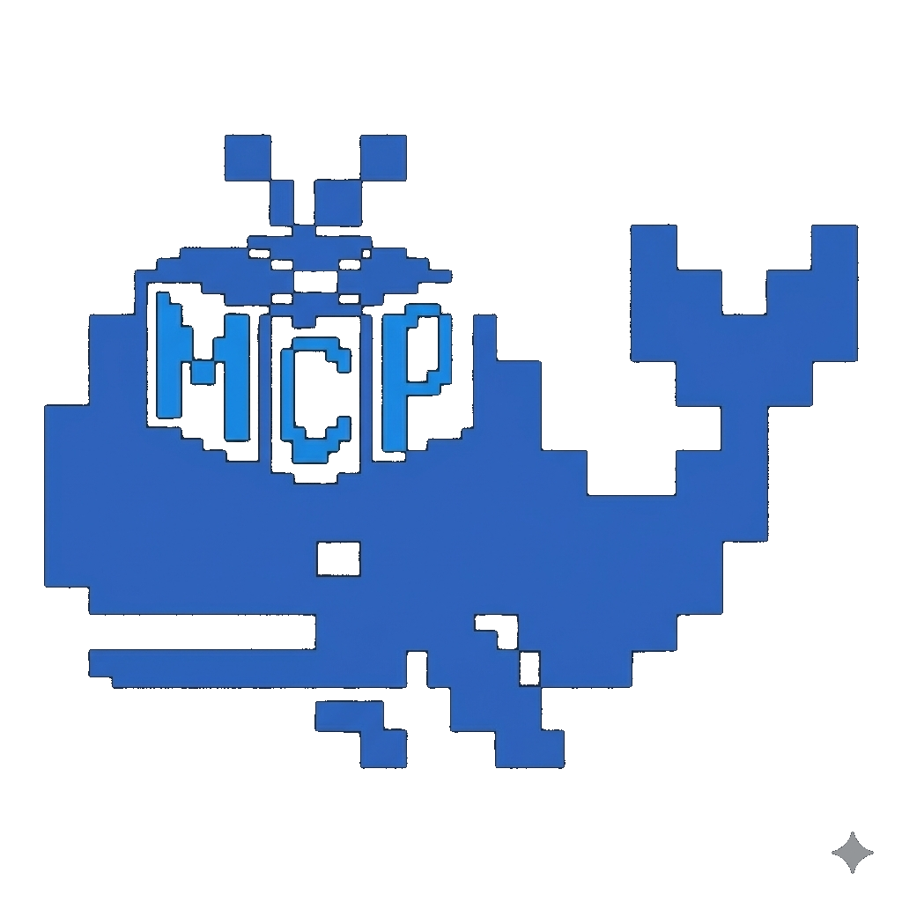

<div align="center">
  
  <h1>mcp-docker-sentinel</h1>
  <p>An MCP server in Rust — let your AI talk to Docker.</p>
</div>


---

This project was born from a dual ambition: to master the Model Context Protocol (MCP) while deepening my expertise in Rust. By building a high-performance bridge between LLMs and Docker infrastructure, I am exploring how low-level systems programming can provide safe, asynchronous, and granular control to AI agents.

## Tools

| Tool | Description | Arguments |
|---|---|---|
| `list_containers` | List all containers (name, image, status) | — |
| `get_logs` | Fetch the last N log lines of a container | `container_id`, `tail` (default: 50) |
| `inspect_container` | Full technical details (network, volumes, env) | `container_id` |
| `stop_container` | Stop a running container | `container_id` |
| `start_container` | Start a stopped container | `container_id` |
| `restart_container` | Restart a running or stopped container | `container_id` |
| `remove_container` | Delete a container | `container_id`, `force` (default: false) |
| `list_images` | List all local Docker images (id, tags, size) | — |
| `get_stats` | Live CPU / memory / network usage for a container | `container_id` |
| `exec_command` | Run a command inside a container (`docker exec`) | `container_id`, `command` (array) |
| `remove_image` | Delete a local image | `image_id`, `force` (default: false) |
| `pull_image` | Pull an image from a registry | `image` |
| `list_networks` | List Docker networks and their connected containers | — |
| `list_volumes` | List Docker volumes | — |

## Requirements

- [Rust](https://rustup.rs/) (edition 2024)
- Docker daemon running locally

## Build

```bash
git clone https://github.com/FabienGaut/mcp-docker-sentinel.git
cd mcp-docker-sentinel
cargo build --release
```

The binary will be at `./target/release/mcp-docker-sentinel`.

For development (unoptimized, faster compilation):

```bash
cargo run
```

## Setup

### Claude Code

**Option 1 — CLI (recommended)**

```bash
claude mcp add docker-sentinel -- ./target/release/mcp-docker-sentinel
```

**Option 2 — Manual config**

Add to `~/.claude/settings.json` (global) or `.claude/settings.json` (per project):

```json
{
  "mcpServers": {
    "docker-sentinel": {
      "command": "./target/release/mcp-docker-sentinel"
    }
  }
}
```

### Claude Desktop

Add to your config file:
- **Linux** — `~/.config/Claude/claude_desktop_config.json`
- **macOS** — `~/Library/Application Support/Claude/claude_desktop_config.json`
- **Windows** — `%APPDATA%\Claude\claude_desktop_config.json`

```json
{
  "mcpServers": {
    "docker-sentinel": {
      "command": "./target/release/mcp-docker-sentinel"
    }
  }
}
```

Restart Claude Desktop after saving.

### Cursor

Add to `.cursor/mcp.json` in your project root (or `~/.cursor/mcp.json` for global):

```json
{
  "mcpServers": {
    "docker-sentinel": {
      "command": "/absolute/path/to/mcp-docker-sentinel"
    }
  }
}
```

### Windsurf

Add to `~/.codeium/windsurf/mcp_config.json`:

```json
{
  "mcpServers": {
    "docker-sentinel": {
      "command": "/absolute/path/to/mcp-docker-sentinel"
    }
  }
}
```

> **Note**: For all configurations above, replace the command path with the absolute path to the built binary (e.g. `/home/user/mcp-docker-sentinel/target/release/mcp-docker-sentinel`).

## Project structure

```
src/
├── main.rs           # MCP server + ServerHandler impl
├── docker/
│   └── client.rs     # Docker API wrapper (bollard)
└── mcp/
    ├── handlers.rs   # Tool dispatch
    └── tools.rs      # Tool definitions & schemas
```


**Configuration**

- Remote Docker daemon support via TCP (`DOCKER_HOST`)
- TLS authentication for remote daemons
- Allowlist / denylist to restrict which containers the AI can touch
- Real-time log streaming instead of tail-only

## License

[MIT](LICENSE)
